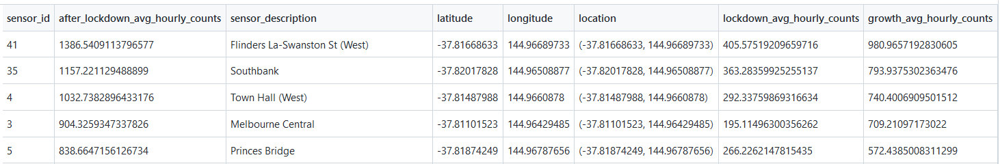

# Pedestrian Counting System - Automated Data Loading, Staging and Visual Analytics

<div class="warning" style='padding:0.1em; background-color:#e6ffff'>
<span>
This project demonstrates an <b>end-to-end data science project</b> from <b>data engineering</b> (including automated data loading, wrangling, and staging) to <b>visual analytics</b> (interactive visualisation dashboards). 
</span>
</div>

The Pedestrian Counting System datasets include locations of pedestrian sensor devices across Melbourne city [[1]](#references) and hourly pedestrian counts from these sensors [[2]](#references).

## Table of Contents

- [Data pipeline architecture](#architecture)
- [Data loading and refresh](#loading)
- [Data profiling and checking (QA)](#profiling)
- [Data wrangling and enhancing](#wrangling)
- [Extracting statistics and metrics](#stats)
- [Data model for staging](#data-model)
- [System requirements](#requirements)
- [Visual analytics](#visual-analytics)
- [References](#references)


## Data pipeline architecture <a name="architecture"> </a>

The overall data pipline architecture is depicted in the diagram below. The main components in the architecture consist of:

- **Data sources**: API endpoints to retrieve the two datasets from external provider [[1,2]](#references)

- **Data flow**: a directed acyclic graphs (**DAG**) of tasks, which is orchestrated by **Airflow** [[3]](#references) (or similar tool like **Jenkins** [[4]](#references)), and executed on a general processing system such as **Spark** [[5]](#references). In this data pipeline workflow shown in the diagram, the tasks annotated with a table icon will stage their resulted data tables into the staging SQL database system for future use. 

- **Staging and warehousing system**: this is a scalable SQL system (e.g., Amazon **Redshift**, Google Big Query, or Microft SQL server) to store staging data and potentially final target data for warehousing

<p align="center">
  
</p>

The table below lists the tasks in the data workflow, together with their description and dependency. In this DAG workflow, tasks that are not dependent of others can be scheduled to run in parallel for enhancing the efficiency of data processing. 

<div align="center">
            
| Task   |  Description | Dependency |
|:-:|:--|:--|
| Task 1.1  | Load hourly counts from API | None  |
| Task 1.2  | Profile & QA hourly counts  | Task 1.1  |
| Task 1.3  | Cleanse & enrich hourly counts  | Task 1.2  |
| Task 2.1  | Load sensor location from API  | None  |
| Task 2.2  | Profile & QA sensor location  | Task 2.1  |
| Task 2.3  | Cleanse sensor location  | Task 2.2  |
| Task 3.1  | Top N locations (most traffic) by Day  | Tasks 1.3 and 2.3  |
| Task 3.2  | Top N locations (most traffic) by Month  | Tasks 1.3 and 2.3  |
| Task 3.3  | Locations most decline since lockdowns  | Tasks 1.3 and 2.3  |
| Task 3.4  | Locations most growth after lockdowns  | Tasks 1.3 and 2.3  |
| Task 3.5  | Peak hours traffic pattern analysis  | Tasks 1.3 and 2.3  |
| Task 3.6  | Weekend vs. Weekday traffic analysis  | Tasks 1.3 and 2.3  |

</div>

## Data loading and refresh<a name="loading"> </a>

The two datasets (sensor location and pedestrian hourly counts) are loaded from **API** endpoints provided by external data provider. 
> **Load frequency**: please note that the source datasets are updated monthly ([[1,2]](#references)) around the middle of the month, hence a **monthly** load frequency of this data pipline is sufficient and suggested to refresh the data. 

The loading script utilises **paging** requests to deal with a large number of records in the dataset (~ 4.5 million of rows in pedestrian hourly counts.)
> **Change detection**: the source systems (API endpoints from data provide) do not support reliable forms of change detection, hence it is suggested to perform a full reload everytime, given that the data size is not very super large. There is scope for optimisation, e.g., only loading data from an offset (the total number of records retrieved since the last data loading); nevertheless, this requires further exploration to ensure the data quality and consistency.

## Data profiling and checking (QA) <a name="profiling"> </a>

A complete **data profiling report** for each dataset was run using `Pandas Profiling` library [[6]](#references). For the detailed reports, please check the following links referring to the html reports stored in the `output` directory of this repository.


> Data profiling reports (for full interactive report viewing experience, it is recommended to download the html from the `output` directory of this repository and view it with local browser)
- [Profiling report of sensor location](https://htmlpreview.github.io/?https://github.com/hoangtamvo/pedestrian-analytics/blob/f943f72c6e5263c0e5e8493f6975ea926db34cad/output/data%20profiling%20sensor%20location.html)
- [Profiling report of pedestrian hourly counts](https://htmlpreview.github.io/?https://github.com/hoangtamvo/pedestrian-analytics/blob/f943f72c6e5263c0e5e8493f6975ea926db34cad/output/data%20profiling%20pedestrian%20per%20hour.html)


The **QA tests** run in the report consist of:
- An overview of the data table
- A detailed analysis of all the variables of the dataset
    - Numeric variable: distinct values, missing values, min-max, mean, and negative values count, small representation values in the form of a histogram, common values and especially extreme values
    - Categorical variable: distinct (unique) values, distinct percentage, missing, missing percentage, and a horizontal bar presentation of all the unique values with count presentation.
- Interaction and correlation analysis between variables, which may reveal interesting findings
- Visualizations for the missing values present in the dataset (count, matrix, and dendrogram)

Overall, according to the data profiling reports, the data looks good; however, several minor **data anomalies** have been identified:
- Special characters ("\n") in the `location` string variable of the sensor location dataset. These are fixed in the next data wrangling section.
- Missing values in the `direction_1` and `direction_2` variables of the sensor location dataset. Further study is warranted to understand the impact of this on further analysis related to the direction of walking pedestrian.   
<p align="center">
  
</p>

Given the time constraint for this project, this documentation is still a `work-in-progress` and apparently, more data checking could have been done and potentially more data issues might have been found. In addition to the data profiling report, there could be other extra QA that can be done, for examples:
- Outlier dedection on numeric variables using Box plots and other statistics methods
- Data consistency and semantics, e.g., whether all the lat/lon locations are in the Melbourne geographical area


## Data wrangling and  enhancing<a name="wrangling"> </a>

### Data cleansing
As described in the above data checking section, there are special characters ("\n") in the `location` string variable of the sensor location dataset. This will impact any downstream analysis and visualisation if they are using this string value. 

Hence, these special characters are removed in the data cleansing task (part of the data pipeline) run on the sensor location dataset. The `cleansed sensor location dataset` was staged in the system for further analysis, and is also publicly available [here](https://github.com/hoangtamvo/pedestrian-analytics/blob/f943f72c6e5263c0e5e8493f6975ea926db34cad/output/SENSOR.csv)  for reference.

### Data enhancing

The data quality of the `pedestrian hourly counts` dataset looks good; nevertheless, the following enhancement has been done to the dataset so that it is easier for the next extracting statistics step.
> Data enrichment
- `date_key`: in the source data, there is only the combined date time information but not the date itself. For data warehousing applications, **time intelligence analytics** is essential, hence a derived variable named `date_key` was created from the date time information. This newly created variable can be used to filter the data based on date, and can also be linked to the **date dimension** table in the datawarehouse for supporting advanced time intelligence analytics such rolling 12-month calculation.  
- `day_type` (weekday or weekend): this is an extra variable dervied from the day column. This newly derived variable is useful for extracting additional statistics to compare weekday against weekend traffic patterns.

The `enriched pedestrian hourly counts` was staged in the system for further analysis, and its small **sample** is also publicly available [here](https://github.com/hoangtamvo/pedestrian-analytics/blob/f943f72c6e5263c0e5e8493f6975ea926db34cad/output/PEDESTRIAN_PER_HOUR_SAMPLE_ONLY.csv)  for reference.

## Extracting statistics (stats) and metrics <a name="stats"> </a>

In this section, more advanced data engineering tasks are conducted to extract statistics from the above cleansed and enriched datasets. Each complex summary statistics are broken down to several small steps which are implemented through common  `reusable modular functions`. Each step can perform the calculation using SQL (various complexity levels) or Python pandas functions or a combination of both.  

The implemented program [`automated load and stage.py`](https://github.com/hoangtamvo/pedestrian-analytics/blob/5d3db52d4c2be8cd89cd082df575aa81d5c62b08/automated%20load%20and%20stage.py) is well-documented with comprehensive code comments and detailed `docstring` for documentation. In addition, a brief explanation of the calculation of these statistics is also provided in the following. Most statistics are looking into comparing the `pedestrian traffic` at different locations or time periods, and hence the basic metrics used for comparison is the `average hourly counts`.


### Stats 1: Top N locations (most pedestrians) by Day

The steps to compute this aggregate analytics summary data include:
    - Calculate average hourly counts by (1) day (Monday to Sunday) and (2) sensor id
    - Join with sensor location data to get location info
    - Calculate the rank within each day group based on average hourly counts
    (rank 1 the most pedestrians). 

By providing the rank in the summary statistics data, any downstream analysis can pick their desired top N. The resulted summary data table `TOP_N_LOCATIONS_BY_DAY` was staged in the SQL database system for further use in downstream analysis, and it is also publicly available [here](https://github.com/hoangtamvo/pedestrian-analytics/blob/5d3db52d4c2be8cd89cd082df575aa81d5c62b08/output/TOP_N_LOCATIONS_BY_DAY.csv)  for reference. Further, the figure below provides a sneak peek of this summary data table, which is showing the top 10 locations (most pedestrians) on Friday.

<p align="center">
  
</p>


### Stats 2: Top N locations (most pedestrians) by Month

The calculation of this statistics summary is similar to that of the above Stats 1 -- we just need to replace the group by clause from Day in Stats 1 to Month in this Stat 2. In fact, in terms of implementation, there is just a single `reusable function` that can calculate Stats 1 and Stat 2, depending on the provided parameter (Day or Month.) 


Similar to Stats 1, by providing the rank in the summary statistics data, any downstream analysis can pick their desired top N. The resulted summary data table `TOP_N_LOCATIONS_BY_MONTH` was staged in the SQL database system for further use in downstream analysis, and it is also publicly available [here](https://github.com/hoangtamvo/pedestrian-analytics/blob/5d3db52d4c2be8cd89cd082df575aa81d5c62b08/output/TOP_N_LOCATIONS_BY_MONTH.csv)  for reference. Further, the figure below provides a sneak peek of this summary data table, which is showing the top 10 locations (most pedestrians) in April.

<p align="center">
  
</p>


### Stats 3: Locations most decline during lockdowns

The steps to compute this aggregate analytics summary data include:
    - Calculate the average hourly counts for each location during `precovid` period
    - Calculate the average hourly counts for each location during `lockdown` periods
    - Compare the average hourly counts for each location between precovid period and during
    lockdown periods, and returns the location having most `decline`. 
    
Note that the decline in traffic is calculated in absolute values (which is also used to choose the most decline location), whereas the decline in percentage values is also calculated and returned. The resulted summary data table `HOURLY_COUNTS_DECLINE_LOCKDOWN` was staged in the SQL database system for further use in downstream analysis, and it is also publicly available [here](https://github.com/hoangtamvo/pedestrian-analytics/blob/5d3db52d4c2be8cd89cd082df575aa81d5c62b08/output/HOURLY_COUNTS_DECLINE_LOCKDOWN.csv)  for reference. Further, the figure below provides a sneak peek of this summary data table, which is showing the top 5 locations with most decline in traffic during lockdowns compared to precovid period.

<p align="center">
  
</p>


### Stats 4: Locations most growth after lockdowns

The steps to compute this aggregate analytics summary data include:
    - Calculate the average hourly counts for each location during `lockdown` periods
    - Calculate the average hourly counts for each location `after lockdown` periods
    - Compare the average hourly counts for each location between during
    lockdown periods and after lockdown, and returns the location having most `growth`. 
    
Stats 4 and Stats 3 share many common implemented functions to do similar calculation but with different parameters. In addition, similar to Stats 3, the growth in traffic is calculated in absolute values (which is also used to choose the most growth location), whereas the growth in percentage values is also calculated and returned. The resulted summary data table `HOURLY_COUNTS_GROWTH_AFTER_LOCKDOWN` was staged in the SQL database system for further use in downstream analysis, and it is also publicly available [here](https://github.com/hoangtamvo/pedestrian-analytics/blob/5d3db52d4c2be8cd89cd082df575aa81d5c62b08/output/HOURLY_COUNTS_GROWTH_AFTER_LOCKDOWN.csv)  for reference. Further, the figure below provides a sneak peek of this summary data table, which is showing the top 5 locations with most growth in traffic during the last year after lockdowns periods.

<p align="center">
  
</p>


### (Extra) Stats 5: Peak hours traffic pattern analysis

This statistics is **beyond the requirements** of the coding test. In this statistics, for each location, we calculate the average hourly counts by time (0-23 hours) in each day in the week. This summary statistics is useful for identifying peak hours in a day at a location.


The resulted summary data table `AVG_HOURLY_COUNTS_BY_DAY_TIME` was staged in the SQL database system for further use in downstream analysis, and it is also publicly available [here](https://github.com/hoangtamvo/pedestrian-analytics/blob/5d3db52d4c2be8cd89cd082df575aa81d5c62b08/output/AVG_HOURLY_COUNTS_BY_DAY_TIME.csv)  for reference. Further, the figure below provides a sneak peek of this summary data table, which is showing the average hourly counts by time of the day (0-23 hours) on Friday at the location of sensor id 16. 

<p align="center">
  
</p>


As can be seen and also as expected, around lunch time appears to be peak hours. This statistics summary data is useful to create a an interactive data visualisation which end users may use to discover spatial and temporal insights as will be shown in the next [Visual analytics](#visual-analytics) section.


### (Extra) Stats 6: Weekday vs. weekend traffic analysis

In this another extra statistics, for each location, we calculate the average hourly counts by time (0-23 hours) during weekday and weekend. This summary statistics is useful for performing traffic analysis of weekend and weekday, and compare them to see if there is any insight.


The resulted summary data table `AVG_HOURLY_COUNTS_WEEKDAY_WEEKEND` was staged in the SQL database system for further use in downstream analysis, and it is also publicly available [here](https://github.com/hoangtamvo/pedestrian-analytics/blob/5d3db52d4c2be8cd89cd082df575aa81d5c62b08/output/AVG_HOURLY_COUNTS_WEEKDAY_WEEKEND.csv)  for reference. Further, the figure below provides a sneak peek of this summary data table, which is showing the average hourly counts by time of the day (0-23 hours) during weekday and weekend at the location of sensor id 16. 

<p align="center">
  
</p>


This full statistics data reveals that pedestrian counts during weekdays fluctuate at peak hours, whereas counts during weekends grow and shrink steadily, which will be depicted in the next [Visual analytics](#visual-analytics) section.


## Data model for staging<a name="data-model"> </a>

So far we have discussed about data wrangling/enriching and extracting stats. As the product of these tasks in the data pipeline workflow, the cleansed/enriched data tables and summary data tables are stored and staged in the SQL database for future use. More details about these staged data tables are listed in the following.

| Table   |  Description | Relationship between tables |
|:--|:--|:--|
| SENSOR  | Cleansed sensor location data | Joinable with other tables by `sensor_id`  |
| PEDESTRIAN_PER_HOUR  | Enriched pedestrian hourly counts  | Joinable with SENSOR table by `sensor_id`  |
| TOP_N_LOCATIONS_BY_DAY  | Stats 1 resulted summary data  | Joinable with SENSOR table by `sensor_id` |
| TOP_N_LOCATIONS_BY_MONTH  | Stats 2 resulted summary data  | Joinable with SENSOR table by `sensor_id`  |
| HOURLY_COUNTS_DECLINE_LOCKDOWN  | Stats 3 resulted summary data  | Joinable with SENSOR table by `sensor_id`  |
| HOURLY_COUNTS_GROWTH_AFTER_LOCKDOWN  | Stats 4 resulted summary data  | Joinable with SENSOR table by `sensor_id`  |
| AVG_HOURLY_COUNTS_BY_DAY_TIME  | Stats 5 resulted summary data  | Joinable with SENSOR table by `sensor_id`  |
| AVG_HOURLY_COUNTS_WEEKDAY_WEEKEND  | Stats 6 resulted summary data  | Joinable with SENSOR table by `sensor_id`  |

Further, the diagram below depicts the **data model** and the relationships between the staged data tables. 

<p align="center">
  
</p>


> **Materialise location** information into **summary data** tables: 
- It is worth noting that for the staged summary data tables, even though in the data model they are joinable with the SENSOR table to retrieve sensor's information such as name and location, in implementation these information are actually already pre-linked and materialised in the summary data table results to support for performance and efficiency of future analysis. 
- This decision is sensible because the size of the summary data tables are small, hence it is better to materialise more information into them, rather than paying computation cost for an extra join operation in the downstream analysis. 

## System requirements <a name="requirements"> </a>

Please note that the data pipeline [architecture section](#architecture) described an ideal setup for a production environment with commercial and scalable systems. 

In this project a `Python built-in SQL database system` (SQLite) was used for demonstration purpose only, and the entire data pipeline workflow was run using  Python (version 3.7.1).

To execute the automated load and stage program:

```bash
 $ python "./automated load and stage.py"
```

## Visual analytics with interactive dashboards <a name="visual-analytics"> </a>

The extracted statistics described in the above section provide opportunities and use cases for interesting visual analytics applications. Two possibilities are sketched in the following while the full implementations are being developed and published into this same repository once they are ready.

### Spatial analysis and Peak hours traffic pattern

An application is being developed using R and RShiny to create a simple **interactive** data visualisation which end users may use to discover **spatial** and **temporal** insights of the pedestrian counting system dataset, e.g., to find locations with most traffic and their peak traffic hours. The extra statistics (peak hours traffic pattern analysis) calculated in the data pipeline workflow as described in the [previous section](#stats) provide the essential data for this application. 

<p align="center">
  
</p>

### Weekday vs. weekend traffic analysis

Another application is also being developed using D3js to create a simple **interactive narrative visualisation** that communicates specific findings to a general audience, e.g., the difference in traffic patterns of weekday against weekend. The extra statistics (weekend vs. weekday traffic analysis) calculated in the data pipeline workflow as described in the [previous section](#stats) makes this application possible.

<p align="center">
  
</p>


## References <a name="references"> </a>
[[1] Dataset 1: Pedestrian Counting System - Sensor Locations](https://data.melbourne.vic.gov.au/Transport/Pedestrian-Counting-System-Sensor-Locations/h57g-5234)

[[2] Dataset 2: Pedestrian Counting System - Monthly (counts per hour)](https://data.melbourne.vic.gov.au/Transport/Pedestrian-Counting-System-Monthly-counts-per-hour/b2ak-trbp)

[[3] Apache Airflow - Programmatic platform for Data Pipelines and ETL/ELT workflows](https://medium.com/analytics-vidhya/apache-airflow-programmatic-platform-for-data-pipelines-and-etl-elt-workflows-b9e4d8346541)

[[4] Automating data pipelines with Jenkins](https://techblog.livongo.com/jenkins-etl/)

[[5] Spark: Unified engine for large-scale data analytics](https://spark.apache.org/)

[[6] Data Profiling with Pandas](https://www.analyticsvidhya.com/blog/2021/06/generate-reports-using-pandas-profiling-deploy-using-streamlit/)
